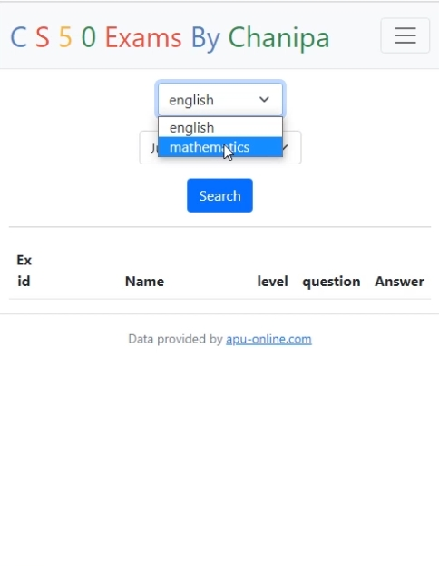

# Online Quiz Platform for Students By Chanipa Supuckchookul

### Video Demo:  [View Demo On Youtube](https://youtu.be/zEw9_0hmrjA)

---

This project aims to develop an online quiz platform that allows students to test their knowledge in mathematics and English. The platform is designed to be reliable and efficient, using Python programming and Mathjax to ensure that mathematical equations are displayed beautifully and easy to read. The database of exam questions is divided into subjects and levels, providing tests for students of different age groups and skill levels.

---

## features
One of the key features of the platform is the immediate feedback provided to students upon completion of the quiz. The system displays the score and a breakdown of correct and incorrect answers, allowing students to see where they need improvement. Additionally, students are able to retake the quiz as many times as they'd like.

This project has the potential to help students improve their knowledge and skills in mathematics and English, providing a valuable resource for young students just starting out, as well as high school students preparing for exams.

---

## Installation
1. Clone the repository to your local machine.
```
git clone ใส่ url ของ project ที่เป็น user ของฌานิ
```
2. Install the necessary dependencies using pip.
```
pip install requests
```
3. Run the app using
```
flask run
```

---
## Usage
To use the quiz platform, simply navigate to the website and select the subject and level of the quiz you'd like to take. After completing the quiz, you'll receive immediate feedback on your score and which questions you answered correctly or incorrectly. You can retake the quiz as many times as you'd like to improve your score.

---
## Registration
To register for the quiz platform, follow these steps:

1. Navigate to the registration page on the website.
2. Enter your desired username and password in the corresponding fields.
3. Confirm your password by re-entering it in the "Confirm Password" field.
4. Click the "Register" button to submit your registration.


---
## How to Exams
To take an exam on the quiz platform, follow these steps:

1. Click on the "Exams" tab in the navigation bar.
2. Select the subject you want to take an exam in.
3. Select the level of the exam you want to take.
4. Click the "Search" button to see a list of available exams.
5. Choose an exam from the list and click on it to begin the exam.




---
## Exams History & Retake Exams
To view your quiz history, follow these steps:

1. Click on the "History" tab in the navigation bar.
2. You'll see a list of all the quizzes you've taken, along with the date and score.
3. Click on a quiz to see more details, including the questions and your answers.
4. You'll be taken to the quiz page, where you can retake the quiz.


---
## Credits
This project was developed by Chanipa Supuckchookul.
Email: chanipa72834@gmail.com